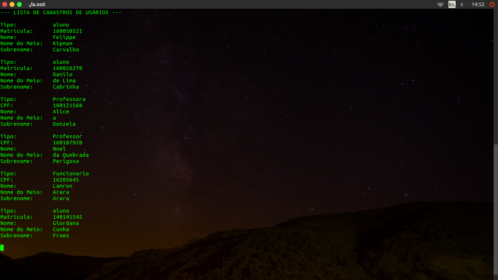

# Introdução

O projeto tem como objetivo automatizar o processo de autorização de entrada ao LINF, por meio de um algoritmo de reconhecimento facial e aplicação de conceitos de programação orientada a objetos.

# Requisitos Para Funcionamento

Para conseguir compilar o projeto, é necessária a instalação dos módulos principais da biblioteca de visão computacional OpenCV, assim como alguns de seus módulos extras. Além disso, é necessário instalar a biblioteca de manipulação de arquivos JSON chamada JsonCpp.

Para instalar OpenCV, digite o seguinte comando em seu terminal:

> sudo apt-get install libopencv-dev python-opencv

Para instalar JsonCpp, digite o seguinte comando em seu terminal:

> sudo apt-get install libjsoncpp-dev

# UML

**Diagrama de Classes**

**Diagramas de Sequência**

*Criando um novo Usuário*

*Criando uma nova Reserva*

# Funcionamento do Sistema

*Menu Principal*

*Criando Um Novo Usuário*

*Criando Uma Nova Reserva*

*Sub-Menu*

*Index de Usuário*

*Index de Reservas*

